<h2 id="sec-1-1">1.1 PIL-Python图像库</h2>

PIL (Python Imaging Library)图像库提供了很多常用的图像处理及很多有用的图像基本操作。PIL库下载地址[\[www.pythonware.com/products/pil/\]](http://www.pythonware.com/products/pil/)。下面演示原书P001-Fig1-1读入一幅图片的例子：

```python
# -*- coding: utf-8 -*-
from PIL import Image
from pylab import *

# 添加中文字体支持
from matplotlib.font_manager import FontProperties
font = FontProperties(fname=r"c:\windows\fonts\SimSun.ttc", size=14)
figure()

pil_im = Image.open('../data/empire.jpg')
gray()
subplot(121)
title(u'原图',fontproperties=font)
axis('off')
imshow(pil_im)

pil_im = Image.open('../data/empire.jpg').convert('L')
subplot(122)
title(u'灰度图',fontproperties=font)
axis('off')
imshow(pil_im)

show()
```
运行上面的代码，可以得出原书P002-Fig1-1中的前两幅图片，如下：
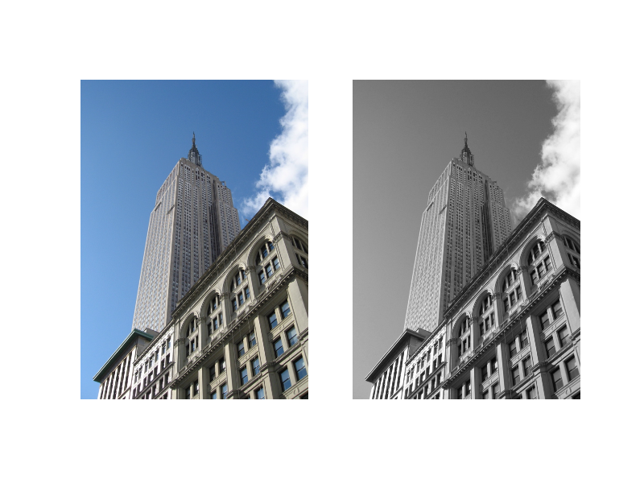
更多关于PIL的实例，可以参阅PIL在线文档[\[www
.pythonware.com/library/pil/handbook/index.htm./\]](http://www.pythonware.com/library/pil/handbook/index.htm)。

<h3 id="sec-1-1-1">1.1.1 对图片进行格式转换</h3>

利用`save()`方法，PIL可以将图片保存问很多不同的图像格式。下面演示原书P002中对图片进行转换的例子。

```python
# -*- coding: utf-8 -*-
from PCV.tools.imtools import get_imlist #导入原书的PCV模块
from PIL import Image
import os
import pickle

filelist = get_imlist('../data/convert_images_format_test/') #获取convert_images_format_test文件夹下的图片文件名(包括后缀名)
imlist = file('../data/convert_images_format_test/imlist.txt','w') #将获取的图片文件列表保存到imlist.txt中
pickle.dump(filelist,imlist) #序列化
imlist.close()

for infile in filelist:
    outfile = os.path.splitext(infile)[0] + ".png" #分离文件名与扩展名
    if infile != outfile:
        try:
            Image.open(infile).save(outfile)
        except IOError:
            print "cannot convert", infile
```
上面convert_images_format_test文件夹是译者放的测试图片，共24幅图像，如下图示，测试图片全部为`.jpg`格式的。译者在源代码中添加了部分代码以便将获取的图像文件名列表保存下来，同时将原来的所有图像转化为`.png`格式的图像。注意，在载入模块时，载入了原书的PCV模块，关于PCV模块的安装，详见[\[PCV模块的安装\]]()运行上面代码，可以得到转化格式后的图像，运行结果为：
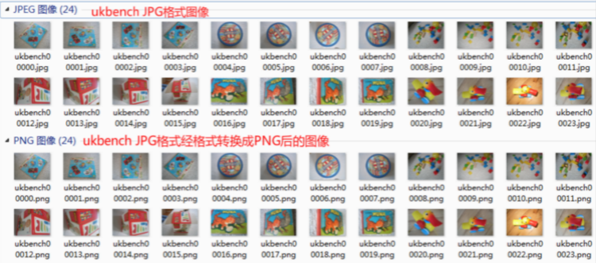

<h3 id="sec-1-1-2">1.1.2 创建缩略图</h3>

利用PIL可以很容易的创建缩略图，设置缩略图的大小，并用元组保存起来，调用thumnail()方法即可生成缩略图。创建缩略图的代码见下面。

<h3 id="sec-1-1-3">1.1.3 拷贝并粘贴区域</h3>

调用crop()方法即可从一幅图像中进行区域拷贝，拷贝出区域后，可以对区域进行旋转等变换。关于拷贝、旋转粘贴的代码见下面。

<h3 id="sec-1-1-4">1.1.4 调整尺寸及旋转</h3>

要对一幅图像的尺寸进行调整，可以调用resize()方法，元组中放置的便是你要调整尺寸的大小。如果要对图像进行旋转变换的话，可以调用rotate()方法。

下面代码显示上面提到的所有的图像处理操作，即原图显示、RGB图像转为灰度图像、拷贝粘贴区域、生成缩略图、调整图像尺寸、图像旋转变换的实例代码：

```python
# -*- coding: utf-8 -*-
from PIL import Image
from pylab import *

# 添加中文字体支持
from matplotlib.font_manager import FontProperties
font = FontProperties(fname=r"c:\windows\fonts\SimSun.ttc", size=14)
figure()

# 显示原图
pil_im = Image.open('../data/empire.jpg')
print pil_im.mode, pil_im.size, pil_im.format
subplot(231)
title(u'原图', fontproperties=font)
axis('off')
imshow(pil_im)

# 显示灰度图
pil_im = Image.open('../data/empire.jpg').convert('L')
gray()
subplot(232)
title(u'灰度图', fontproperties=font)
axis('off')
imshow(pil_im)

#拷贝粘贴区域
pil_im = Image.open('../data/empire.jpg')
box = (100,100,400,400)
region = pil_im.crop(box)
region = region.transpose(Image.ROTATE_180)
pil_im.paste(region,box)
subplot(233)
title(u'拷贝粘贴区域', fontproperties=font)
axis('off')
imshow(pil_im)

# 缩略图
pil_im = Image.open('../data/empire.jpg')
size = 128, 128
pil_im.thumbnail(size)
print pil_im.size
subplot(234)
title(u'缩略图', fontproperties=font)
axis('off')
imshow(pil_im)
pil_im.save('../images/ch01/thumbnail.jpg') #保存缩略图

# 调整图像尺寸
pil_im = Image.open('../data/empire.jpg')
pil_im = pil_im.resize(size)
print pil_im.size
subplot(235)
title(u'调整尺寸后的图像', fontproperties=font)
axis('off')
imshow(pil_im)

# 旋转图像45°
pil_im = Image.open('../data/empire.jpg')
pil_im = pil_im.rotate(45)
subplot(236)
title(u'旋转45°后的图像', fontproperties=font)
axis('off')
imshow(pil_im)

show()
```
运行上面代码，可得P002 Figure 1-1中出现的所有实例图,结果如下：
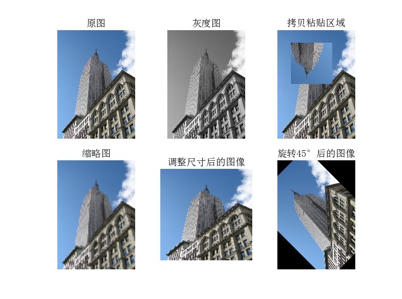

<h2 id="sec-1-2">1.2 Matplotlib库</h2>

当在处理数学及绘图或在图像上描点、画直线、曲线时，Matplotlib是一个很好的绘图库，它比PIL库提供了更有力的特性。Matplotlib是开源的，可以在[\[matplotlib.sourceforge.net\]](http://matplotlib.sourceforge.net/)上下载，并且它还提供了详细的文档及教程。这里，会展示一些我们在本书后面会用到的函数的一些实例。

<h3 id="sec-1-2-1">1.2.1 画图、描点和线</h3>

虽然Matplotlib可以创建漂亮的条状图、饼图、散点图等，但是在很多计算机视觉应用场合，其实只用到了一些常用的命令。下面展示在一幅图像上描一些点和画一条直线的例子。

```python
# -*- coding: utf-8 -*-
from PIL import Image
from pylab import *

# 添加中文字体支持
from matplotlib.font_manager import FontProperties
font = FontProperties(fname=r"c:\windows\fonts\SimSun.ttc", size=14)

im = array(Image.open('../data/empire.jpg'))
figure()

# 画有坐标轴的
subplot(121)
imshow(im)
x = [100, 100, 400, 400]
y = [200, 500, 200, 500]
plot(x, y, 'r*')
plot(x[:2], y[:2])
title(u'绘图: "empire.jpg"', fontproperties=font)

# 不显示坐标轴
subplot(122)
imshow(im)
x = [100, 100, 400, 400]
y = [200, 500, 200, 500]
plot(x, y, 'r*')
plot(x[:2], y[:2])
axis('off')  #显示坐标轴
title(u'绘图: "empire.jpg"', fontproperties=font)

show()
```
运行上面代码，即可得原书P005中 Figure 1-2中左边的结果。去掉上面代码中坐标轴的注释，即可得 Figure 1-2中右边的结果。运行结果如下：

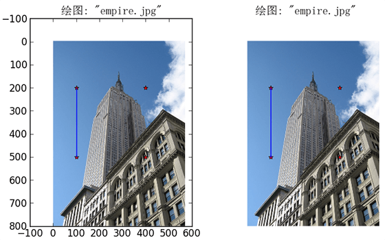

<h3 id="sec-1-2-2">1.2.2 图像轮廓和直方图</h3>

下面我们看两个特别的例子：图像轮廓线和图线等高线。在画图像轮廓前需要转换为灰度图像，因为轮廓需要获取每个坐标[x,y]位置的像素值。下面是画图像轮廓和直方图的代码：

```python
 # -*- coding: utf-8 -*-
from PIL import Image
from pylab import *

# 添加中文字体支持
from matplotlib.font_manager import FontProperties
font = FontProperties(fname=r"c:\windows\fonts\SimSun.ttc", size=14)
im = array(Image.open('../data/empire.jpg').convert('L'))  # 打开图像，并转成灰度图像

figure()
subplot(121)
gray()
contour(im, origin='image')
axis('equal')
axis('off')
title(u'图像轮廓', fontproperties=font)

subplot(122)
hist(im.flatten(), 128)
title(u'图像直方图', fontproperties=font)
plt.xlim([0,260])
plt.ylim([0,11000])

show()
```
运行上面代码，可以得到书中的图1-3所示的结果:
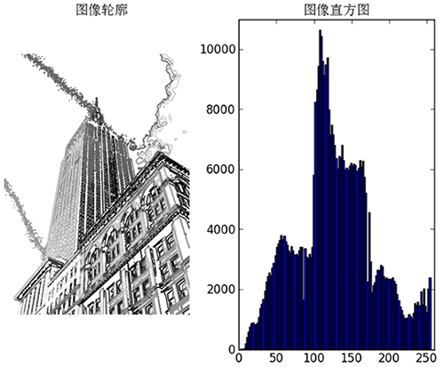

<h3 id="sec-1-2-4">1.2.4 交互注释</h3>

有时，用户需要和应用进行交互，比如在图像中用点做标识，或者在一些训练数据中进行注释。PyLab提供了一个很简洁好用的函数ginput(),它可以完成该任务，下面是一个演示交互注释的简短示例：

```python
from PIL import Image
from pylab import *

im = array(Image.open('../data/empire.jpg'))
imshow(im)
print 'Please click 3 points'
imshow(im)
x = ginput(3)
print 'You clicked:', x

show()
```
上面代码先读取empire.jpg图像，显示读取的图像，然后用ginput()交互注释，这里设置的交互注释数据点设置为3个，用户在注释后，会将注释点的坐标打印出来。

<h2 id="sec-1-3">1.3 NumPy库</h2>

[NumPy](http://www.scipy.org/NumPy/)是Python一个流行的用于科学计算包。它包含了很多诸如矢量、矩阵、图像等其他非常有用的对象和线性代数函数。在本书中几乎所有的例子都用到了NumPy数组对象。NumPy可以在[scipy.org/Download\]](http://www.scipy.org/Download)下载，[在线文档](http://docs.scipy.org/doc/numpy/)包含了很多常见问题的答案。

<h3 id="sec-1-3-1">1.3.1 图像数组表示</h3>

在前面载入图像的示例中，我们将图像用array()函数转为NumPy数组对象，但是并没有提到它表示的含义。数组就像列表一样，只不过它规定了数组中的所有元素必须是相同的类型。下面的例子用于说明图像数组表示：

```python
 # -*- coding: utf-8 -*-
from PIL import Image
from pylab import *

im = array(Image.open('../data/empire.jpg'))
print im.shape, im.dtype
im = array(Image.open('../data/empire.jpg').convert('L'),'f')
print im.shape, im.dtype
```
运行上面代码，会给出下面结果：

```text
(800, 569, 3) uint8
(800, 569) float32
```
数组可以通过索引访问和操作其中的元素。比如：value=im[i,j,k]。i,j是坐标，k是颜色通道。对于多个元素，可以用切片操作，如：

```text
im[i,:] = im[j,:] # set the values of row i with values from row j
im[:,i] = 100 # set all values in column i to 100
im[:100,:50].sum() # the sum of the values of the first 100 rows and 50 columns
im[50:100,50:100] # rows 50-100, columns 50-100 (100th not included)
im[i].mean() # average of row i
im[:,-1] # last column
im[-2,:] (or im[-2]) # second to last row
```
在使用数组时有很多操作和方式，我们会在后面介绍贯穿于本书所需要的操作。

<h3 id="sec-1-3-2">1.3.2 灰度变换</h3>

在读入图像到NumPy数组后，就可以对它进行任何我们想要的操作了。对图像进行灰度变换便是一个简单的例子。这里给出一些进行灰度变换的例子：

```python
 # -*- coding: utf-8 -*-
from PIL import Image
from numpy import *
from pylab import *

im = array(Image.open('../data/empire.jpg').convert('L'))
print int(im.min()), int(im.max())

im2 = 255 - im  # invert image
print int(im2.min()), int(im2.max())

im3 = (100.0/255) * im + 100  # clamp to interval 100...200
print int(im3.min()), int(im3.max())

im4 = 255.0 * (im/255.0)**2  # squared
print int(im4.min()), int(im4.max())

figure()
gray()
subplot(1, 3, 1)
imshow(im2)
axis('off')
title(r'$f(x)=255-x$')

subplot(1, 3, 2)
imshow(im3)
axis('off')
title(r'$f(x)=\frac{100}{255}x+100$')

subplot(1, 3, 3)
imshow(im4)
axis('off')
title(r'$f(x)=255(\frac{x}{255})^2$')
show()
```
上面左边灰度变换函数采用的是f(x)=255-x,中间采用的是f(x)=(100/255)x+100,右边采用的是变换函数是f(x)=255(x/255)^2。运行上面代码，可以得到P009 Fig1-5中的结果：
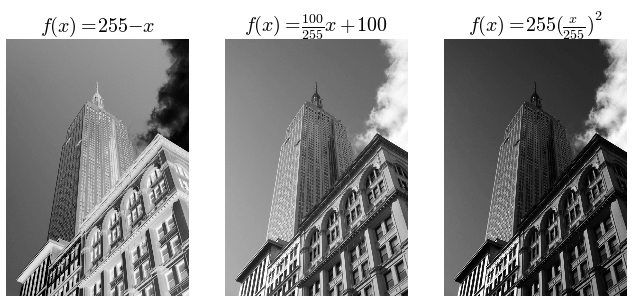
正如上面代码所示，你可以用通过下面命令检查每幅图像的最小值和最大值：

```text
print int(im.min()), int(im.max())
```
如果你对每幅图像用到了打印最小像素值和最大像素值，你会得到下面的输出结果：

```text
2 255
0 253
100 200
0 255
```

<h3 id="sec-1-3-3">1.3-3 调整图像尺寸</h3>

NumPy数组将成为我们对图像及数据进行处理的最主要工具，但是调整矩阵大小并没有一种简单的方法。我们可以用PIL图像对象转换写一个简单的图像尺寸调整函数：

```python
def imresize(im,sz):
    """    Resize an image array using PIL. """
    pil_im = Image.fromarray(uint8(im))
    
    return array(pil_im.resize(sz))
```
上面定义的调整函数，在imtools.py中你可以找到它。

<h2 id="sec-1-3-3">1.3.3 直方图均衡化</h2>

一个极其有用的例子是灰度变换后进行直方图均衡化。图像均衡化作为预处理操作，在归一化图像强度时是一个很好的方式，并且通过直方图均衡化可以增加图像对比度。下面是对图像直方图进行均衡化处理的例子：

```python
 # -*- coding: utf-8 -*-
from PIL import Image
from pylab import *
from PCV.tools import imtools

# 添加中文字体支持
from matplotlib.font_manager import FontProperties
font = FontProperties(fname=r"c:\windows\fonts\SimSun.ttc", size=14)

im = array(Image.open('../data/empire.jpg').convert('L'))  # 打开图像，并转成灰度图像
#im = array(Image.open('../data/AquaTermi_lowcontrast.JPG').convert('L'))
im2, cdf = imtools.histeq(im)

figure()
subplot(2, 2, 1)
axis('off')
gray()
title(u'原始图像', fontproperties=font)
imshow(im)

subplot(2, 2, 2)
axis('off')
title(u'直方图均衡化后的图像', fontproperties=font)
imshow(im2)

subplot(2, 2, 3)
axis('off')
title(u'原始直方图', fontproperties=font)
#hist(im.flatten(), 128, cumulative=True, normed=True)
hist(im.flatten(), 128, normed=True)

subplot(2, 2, 4)
axis('off')
title(u'均衡化后的直方图', fontproperties=font)
#hist(im2.flatten(), 128, cumulative=True, normed=True)
hist(im2.flatten(), 128, normed=True)

show()
```
运行上面代码，可以得到书中的结果：
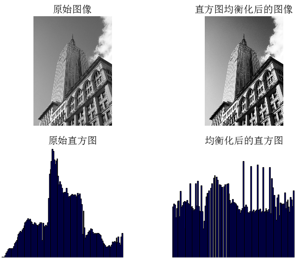
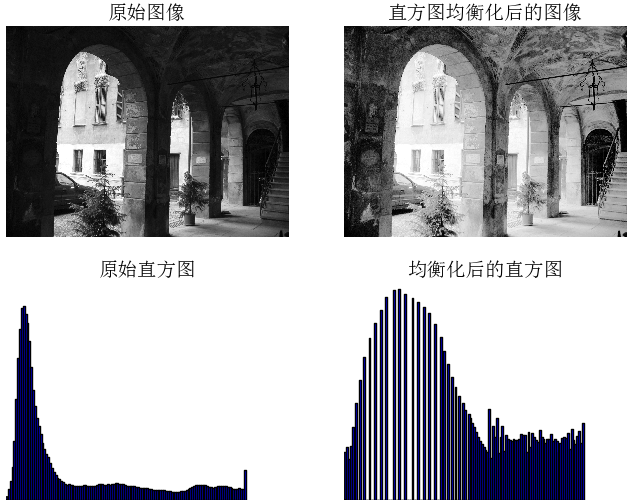

<h3 id="sec-1-3-4">1.3.4 图像平均</h3>

对图像取平均是一种图像降噪的简单方法，经常用于产生艺术效果。假设所有的图像具有相同的尺寸，我们可以对图像相同位置的像素相加取平均，下面是一个演示对图像取平均的例子：

```python
# -*- coding: utf-8 -*-
from PCV.tools.imtools import get_imlist
from PIL import Image
from pylab import *
from PCV.tools import imtools

# 添加中文字体支持
from matplotlib.font_manager import FontProperties
font = FontProperties(fname=r"c:\windows\fonts\SimSun.ttc", size=14)

filelist = get_imlist('../data/avg/') #获取convert_images_format_test文件夹下的图片文件名(包括后缀名)
avg = imtools.compute_average(filelist)

for impath in filelist:
        im1 = array(Image.open(impath))
        subplot(2, 2, filelist.index(impath)+1)
        imshow(im1)
        imNum=str(filelist.index(impath)+1)
        title(u'待平均图像'+imNum, fontproperties=font)
        axis('off')
subplot(2, 2, 4)
imshow(avg)
title(u'平均后的图像', fontproperties=font)
axis('off')

show()
```
运行上面代码，可得对3幅图像平均后的效果，如下图：
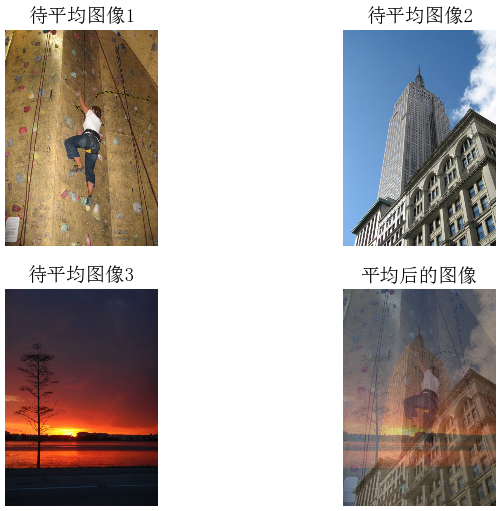

<h3 id="sec-1-3-5">1.3.5 对图像进行主成分分析</h3>

主成分分析是一项有用的降维技术。对于主成分分析的原理，这里不做具体介绍。下面我们在字体图像上进行降维处理。文件fontimages.zip包含有字母"a"的缩略图，共有2359个字体图像，可以在[\[Images courtesy of Martin Solli\]](http://webstaff.itn.liu.se/~marso/)下载。下面代码是显示原书P14页对字体图像进行主成分分析的实例代码：

```python
 # -*- coding: utf-8 -*-
import pickle
from PIL import Image
from numpy import *
from pylab import *
from PCV.tools import imtools, pca

# Uses sparse pca codepath.
#imlist = imtools.get_imlist('../data/selectedfontimages/a_selected_thumbs')

# 获取图像列表和他们的尺寸
imlist = imtools.get_imlist('../data/fontimages/a_thumbs')  # fontimages.zip is part of the book data set
im = array(Image.open(imlist[0]))  # open one image to get the size
m, n = im.shape[:2]  # get the size of the images
imnbr = len(imlist)  # get the number of images
print "The number of images is %d" % imnbr

# Create matrix to store all flattened images
immatrix = array([array(Image.open(imname)).flatten() for imname in imlist], 'f')

# PCA降维
V, S, immean = pca.pca(immatrix)

# 保存均值和主成分
#f = open('../ch01/font_pca_modes.pkl', 'wb')
#pickle.dump(immean,f)
#pickle.dump(V,f)
#f.close()

# Show the images (mean and 7 first modes)
# This gives figure 1-8 (p15) in the book.
figure()
gray()
subplot(2, 4, 1)
axis('off')
imshow(immean.reshape(m, n))
for i in range(7):
    subplot(2, 4, i+2)
    imshow(V[i].reshape(m, n))
    axis('off')
show()
```
注意，这些图像在拉成一维表示后，必须用reshape()函数将它重新转换回来。运行上面代码，可得原书P15 Figure1-8中的结果，即：
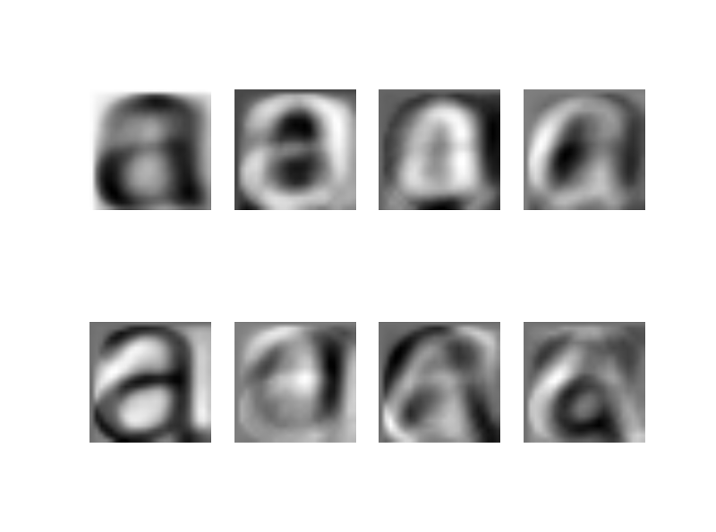

<h3 id="sec-1-3-6">1.3.6 Pickle模块</h3>

如果你想将结果保存下来，或者将数据保存下来以便后面使用，那么pickle模块是非常有用的。Pickle模块能够获取几乎所有的Python对象，并将它转换成字符串表示，该过程称为封装；从字符串表示重构对象的过程为拆封。下面用一个例子对其进行说明。正如你在上面注释部分看到的一样，假设我们想将前一节字体图像的平均值和主成分保存起来，可以通过下面操作：

```python
f = open('../data/fontimages/font_pca_modes.pkl', 'wb')
pickle.dump(immean,f)
pickle.dump(V,f)
f.close()
```
上面在使用封装操作前，需要导入pickle模块。如果要载入保存的.pkl数据，可以通过load()方法，如下：

```
# load mean and principal components
f = open('../data/fontimages/font_pca_modes.pkl', 'rb')
immean = pickle.load(f)
V = pickle.load(f)
f.close()
```
使用with()方法在这里不介绍，具体的可以翻阅原书。关于pickle模块的更多细节可以查阅在线文档[\[docs.python.org/library/pickle.html\\]](http://docs.python.org/library/pickle.html\)

<h2 id="sec-1-4">1.4 SciPy模块</h2>

[SciPy](http://scipy.org/)是一个开源的数学工具包，它是建立在NumPy的基础上的。它提供了很多有效的常规操作，包括数值综合、最优化、统计、信号处理以及图像处理。正如接下来所展示的，SciPy库包含了很多有用的模块。SciPy库可以再[\[http://scipy.org/Download\]](scipy.org/Download)下载。

<h3 id="sec-1-4-1">1.4.1 图像模糊</h3>

一个经典的并且十分有用的图像卷积例子是对图像进行高斯模糊。高斯模糊可以用于定义图像尺度、计算兴趣点以及很多其他的应用场合。下面是对图像进行模糊显示原书P017 Fig1-9的例子。

```python
 # -*- coding: utf-8 -*-
from PIL import Image
from pylab import *
from scipy.ndimage import filters

# 添加中文字体支持
from matplotlib.font_manager import FontProperties
font = FontProperties(fname=r"c:\windows\fonts\SimSun.ttc", size=14)

#im = array(Image.open('board.jpeg'))
im = array(Image.open('../data/empire.jpg').convert('L'))

figure()
gray()
axis('off')
subplot(1, 4, 1)
axis('off')
title(u'原图', fontproperties=font)
imshow(im)

for bi, blur in enumerate([2, 5, 10]):
  im2 = zeros(im.shape)
  im2 = filters.gaussian_filter(im, blur)
  im2 = np.uint8(im2)
  imNum=str(blur)
  subplot(1, 4, 2 + bi)
  axis('off')
  title(u'标准差为'+imNum, fontproperties=font)
  imshow(im2)

#如果是彩色图像，则分别对三个通道进行模糊
#for bi, blur in enumerate([2, 5, 10]):
#  im2 = zeros(im.shape)
#  for i in range(3):
#    im2[:, :, i] = filters.gaussian_filter(im[:, :, i], blur)
#  im2 = np.uint8(im2)
#  subplot(1, 4,  2 + bi)
#  axis('off')
#  imshow(im2)

show()
```
运行上面代码，可得P017 Fig1-9中的结果：
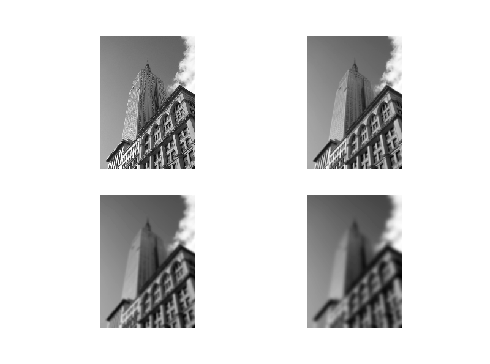
上面第一幅图为待模糊图像，第二幅用高斯标准差为2进行模糊，第三幅用高斯标准差为5进行模糊，最后一幅用高斯标准差为10进行模糊。关于该模块的使用以及参数选择的更多细节，可以参阅SciPy scipy.ndimage文档[\[docs.scipy.org/doc/scipy/reference/ndimage.html\]](http://docs.scipy.org/doc/scipy/reference/ndimage.html)。


<h3 id="sec-1-4-2">1.4.2 图像差分</h3>

图像强度的改变是一个重要的信息，被广泛用以很多应用中，正如它贯穿于本书中。下面是对图像进行差分显示原书P019 Fig1-10的例子。

```python
# -*- coding: utf-8 -*-
from PIL import Image
from pylab import *
from scipy.ndimage import filters
import numpy

# 添加中文字体支持
from matplotlib.font_manager import FontProperties
font = FontProperties(fname=r"c:\windows\fonts\SimSun.ttc", size=14)

im = array(Image.open('../data/empire.jpg').convert('L'))
gray()

subplot(1, 4, 1)
axis('off')
title(u'(a)原图', fontproperties=font)
imshow(im)

# Sobel derivative filters
imx = zeros(im.shape)
filters.sobel(im, 1, imx)
subplot(1, 4, 2)
axis('off')
title(u'(b)x方向差分', fontproperties=font)
imshow(imx)

imy = zeros(im.shape)
filters.sobel(im, 0, imy)
subplot(1, 4, 3)
axis('off')
title(u'(c)y方向差分', fontproperties=font)
imshow(imy)

#mag = numpy.sqrt(imx**2 + imy**2)
mag = 255-numpy.sqrt(imx**2 + imy**2)
subplot(1, 4, 4)
title(u'(d)梯度幅度', fontproperties=font)
axis('off')
imshow(mag)

show()
```
运行上面代码，可得P019 Fig1-10中的运行结果：
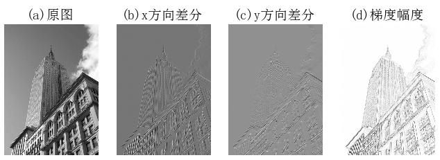
再看一个高斯差分的例子，运行下面代码可得原书P020 Fig1-11页对图像进行高斯差分示例：

```python
 # -*- coding: utf-8 -*-
from PIL import Image
from pylab import *
from scipy.ndimage import filters
import numpy

# 添加中文字体支持
#from matplotlib.font_manager import FontProperties
#font = FontProperties(fname=r"c:\windows\fonts\SimSun.ttc", size=14)

def imx(im, sigma):
    imgx = zeros(im.shape)
    filters.gaussian_filter(im, sigma, (0, 1), imgx)
    return imgx


def imy(im, sigma):
    imgy = zeros(im.shape)
    filters.gaussian_filter(im, sigma, (1, 0), imgy)
    return imgy


def mag(im, sigma):
    # there's also gaussian_gradient_magnitude()
    #mag = numpy.sqrt(imgx**2 + imgy**2)
    imgmag = 255 - numpy.sqrt(imgx ** 2 + imgy ** 2)
    return imgmag


im = array(Image.open('../data/empire.jpg').convert('L'))
figure()
gray()

sigma = [2, 5, 10]

for i in  sigma:
    subplot(3, 4, 4*(sigma.index(i))+1)
    axis('off')
    imshow(im)
    imgx=imx(im, i)
    subplot(3, 4, 4*(sigma.index(i))+2)
    axis('off')
    imshow(imgx)
    imgy=imy(im, i)
    subplot(3, 4, 4*(sigma.index(i))+3)
    axis('off')
    imshow(imgy)
    imgmag=mag(im, i)
    subplot(3, 4, 4*(sigma.index(i))+4)
    axis('off')
    imshow(imgmag)

show()
```
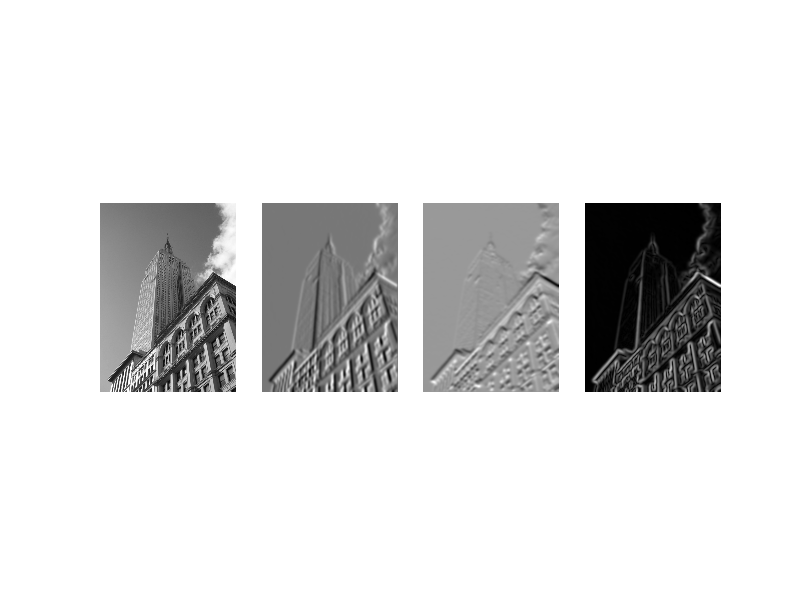
注意运行的结果在摆放位置时与原书P020 Fig1-11结果稍微不同。上面代码中，第一行标准差为2，列分别表示的是x、y和mag,第二行和第三行依次类推。

<h3 id="sec-1-4-3">1.4.3 形态学-物体计数</h3>

形态学常用于二值图像，不过它也可以用于灰度图像。二值图像像素只有两种取值，通常是0和1。二值图像通常是由一幅图像进行二值化处理后的产生的，它可以用于用于对物体进行计数，或计算它们的大小。对形态学的介绍和较好的介绍是wiki[\[en.wikipedia.org/wiki/Mathematical_morphology\]](http://en.wikipedia.org/wiki/Mathematical_morphology)。

形态学操作包括在sci.ndimage模块morphology中。下面我们看一个简单地怎样使用它们例子。

```python
# -*- coding: utf-8 -*-
from PIL import Image
from numpy import *
from scipy.ndimage import measurements, morphology
from pylab import *

"""   This is the morphology counting objects example in Section 1.4.  """

# 添加中文字体支持
from matplotlib.font_manager import FontProperties
font = FontProperties(fname=r"c:\windows\fonts\SimSun.ttc", size=14)

# load image and threshold to make sure it is binary
figure()
gray()
im = array(Image.open('../data/houses.png').convert('L'))
subplot(221)
imshow(im)
axis('off')
title(u'原图', fontproperties=font)
im = (im < 128)

labels, nbr_objects = measurements.label(im)
print "Number of objects:", nbr_objects
subplot(222)
imshow(labels)
axis('off')
title(u'标记后的图', fontproperties=font)

# morphology - opening to separate objects better
im_open = morphology.binary_opening(im, ones((9, 5)), iterations=2)
subplot(223)
imshow(im_open)
axis('off')
title(u'开运算后的图像', fontproperties=font)

labels_open, nbr_objects_open = measurements.label(im_open)
print "Number of objects:", nbr_objects_open
subplot(224)
imshow(labels_open)
axis('off')
title(u'开运算后进行标记后的图像', fontproperties=font)

show()
```
运行上面代码，可得原书P022 Fig1-12的结果：
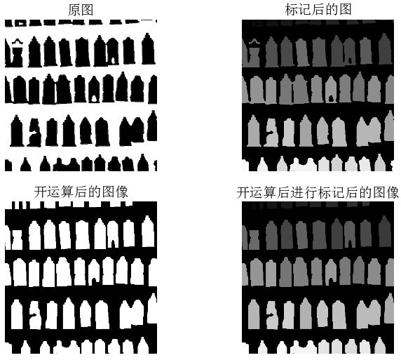
同时打印计数结果为：

```text
Number of objects: 45
Number of objects: 48
```
更多关于形态学可以参阅scipy.ndimage在线文档[\[docs.scipy.org/doc/scipy/reference/ndimage.html\]](http://docs.scipy.org/doc/scipy/reference/ndimage.html)。

<h3 id="sec-1-4-4">1.4.4 有用的SciPy模块</h3>

SciPy有一些用于输入和输出数据有用的模块，其中两个是io和misc。

#####读写.mat文件
如果你有一些数据存储在Matlab .mat文件中，可以用scipy.io模块读取：

```text
data = scipy.io.loadmat('test.mat')
```
如果要保存到.mat文件中的话，同样也很容易，仅仅只需要创建一个字典，字典中即可保存你想保存的所有变量，然后用savemat()方法即可：

```text
#创建字典
data = {}
#将变量x保存在字典中
data['x'] = x
scipy.io.savemat('test.mat',data)
```
更多关于scipy.io的信息可以参阅在线文档[\[docs.scipy.org/doc/scipy/reference/io.html\]](http://docs.scipy.org/doc/scipy/reference/io.html)。

#####保存数组为图像
在scipy.misc模块中，包含了imsave()函数，要保存数组为一幅图像，可通过下面方式完成：

```python
from scipy.misc import imsave
imsave('test.jpg',im)
```
scipy.misc模块中还包含了著名的"Lena"测试图像：

```text
lena = scipy.misc.lena()
```
上面得到的lena图像是一幅512*512大小的灰度图像。

<h2 id="sec-1-5">1.5 更高级的例子：图像降噪</h2>

我们以一个非常有用的例子结束本章。图像降噪是一个在尽可能保持图像细节和结构信息时去除噪声的过程。我们采用Rudin-Osher-Fatemi de-noising(ROF)模型。图像去噪可以应用于很多场合，它涵盖了从你的度假照片使之更好看到卫星照片质量提高。

下面我们看一个图像降噪的综合实例：

```python
# -*- coding: utf-8 -*-
from pylab import *
from numpy import *
from numpy import random
from scipy.ndimage import filters
from scipy.misc import imsave
from PCV.tools import rof

""" This is the de-noising example using ROF in Section 1.5. """

# 添加中文字体支持
from matplotlib.font_manager import FontProperties
font = FontProperties(fname=r"c:\windows\fonts\SimSun.ttc", size=14)

# create synthetic image with noise
im = zeros((500,500))
im[100:400,100:400] = 128
im[200:300,200:300] = 255
im = im + 30*random.standard_normal((500,500))

U,T = rof.denoise(im,im)
G = filters.gaussian_filter(im,10)


# save the result
#imsave('synth_original.pdf',im)
#imsave('synth_rof.pdf',U)
#imsave('synth_gaussian.pdf',G)


# plot
figure()
gray()

subplot(1,3,1)
imshow(im)
#axis('equal')
axis('off')
title(u'原噪声图像', fontproperties=font)

subplot(1,3,2)
imshow(G)
#axis('equal')
axis('off')
title(u'高斯模糊后的图像', fontproperties=font)

subplot(1,3,3)
imshow(U)
#axis('equal')
axis('off')
title(u'ROF降噪后的图像', fontproperties=font)

show()
```
运行上面代码，可得到原书P025 Fig1-13的结果，如下图示：
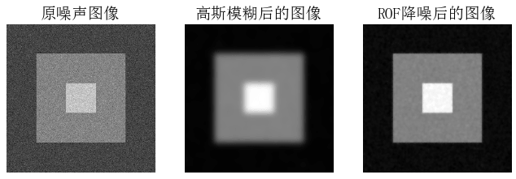
其中第一幅图示原噪声图像，中间一幅图示用标准差为10进行高斯模糊后的结果，最右边一幅图是用ROF降噪后的图像。上面原噪声图像是模拟出来的图像，现在我们在真实的图像上进行测试：

```python
# -*- coding: utf-8 -*-
from PIL import Image
from pylab import *
from numpy import *
from numpy import random
from scipy.ndimage import filters
from scipy.misc import imsave
from PCV.tools import rof

""" This is the de-noising example using ROF in Section 1.5. """

# 添加中文字体支持
from matplotlib.font_manager import FontProperties
font = FontProperties(fname=r"c:\windows\fonts\SimSun.ttc", size=14)

im = array(Image.open('../data/empire.jpg').convert('L'))

U,T = rof.denoise(im,im)
G = filters.gaussian_filter(im,10)


# save the result
#imsave('synth_original.pdf',im)
#imsave('synth_rof.pdf',U)
#imsave('synth_gaussian.pdf',G)


# plot
figure()
gray()

subplot(1,3,1)
imshow(im)
#axis('equal')
axis('off')
title(u'原噪声图像', fontproperties=font)

subplot(1,3,2)
imshow(G)
#axis('equal')
axis('off')
title(u'高斯模糊后的图像', fontproperties=font)

subplot(1,3,3)
imshow(U)
#axis('equal')
axis('off')
title(u'ROF降噪后的图像', fontproperties=font)

show()
```
同样，运行上面代码，可得原书P026 Fig1-14的结果，结果如下：
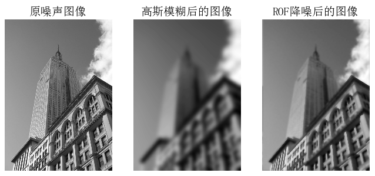
正如你所看到的，在去除噪声的同时，ROF降噪能够保持边缘和图像结构。