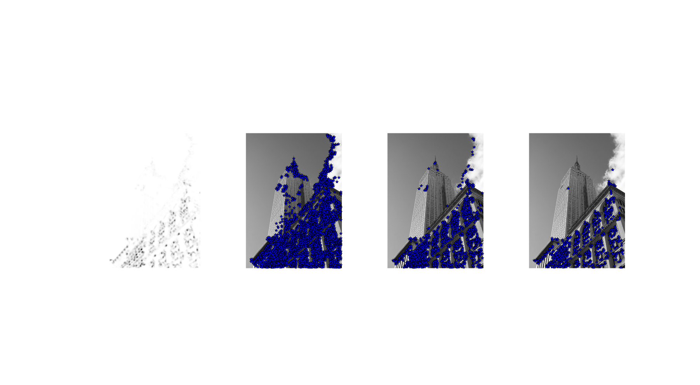
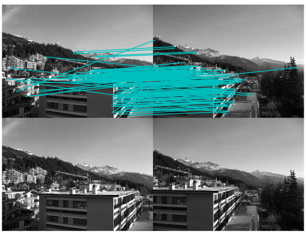
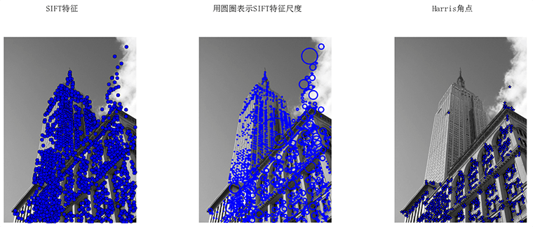
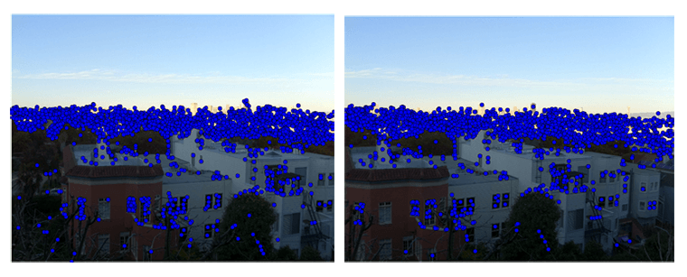
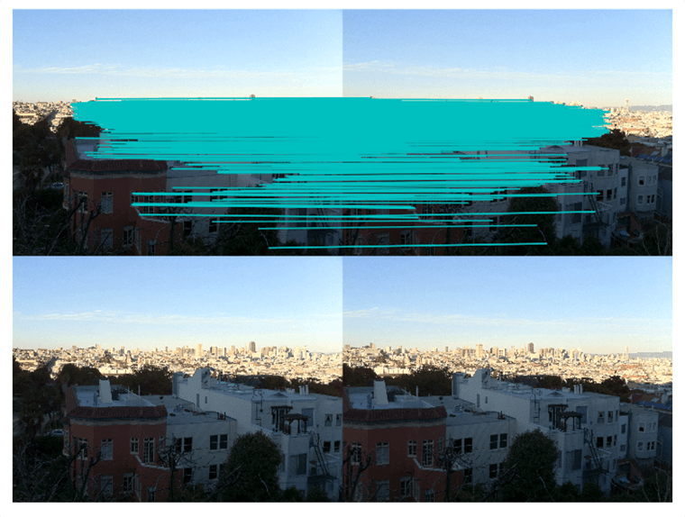
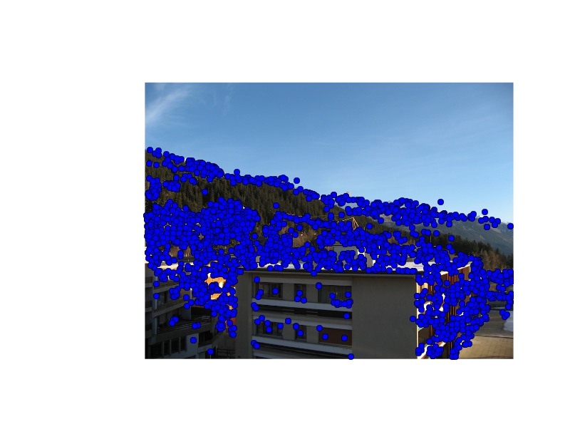
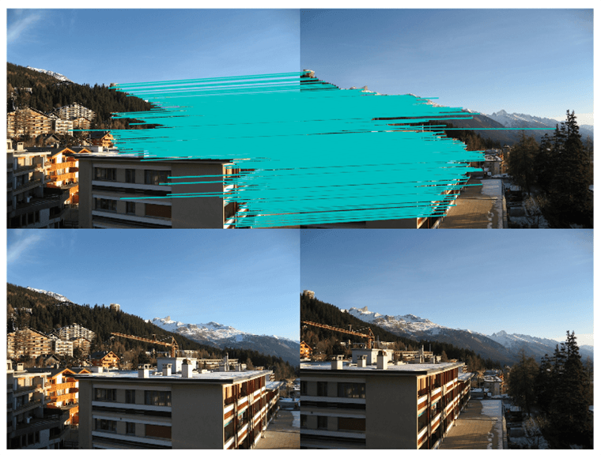
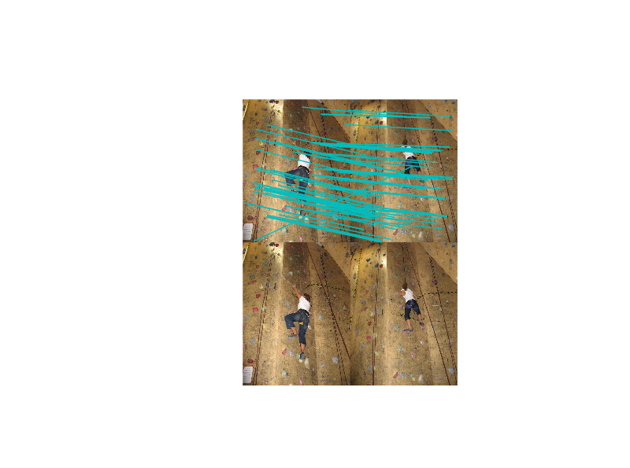
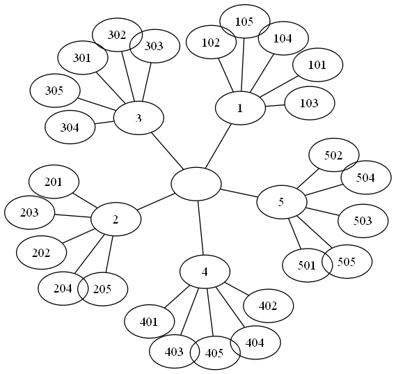
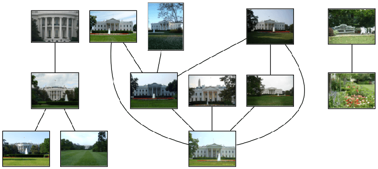

这一章主要介绍两种非常典型的、不同的图像描述子，这两种图像描述子的使用将贯穿于本书，并且作为重要的局部特征，它们应用到了很多应用领域，比如创建全景图、增强现实、3维重建等。

<h2 id="sec-2-1">2.1 Harris角点检测</h2>

Harris角点检测算法是最简单的角点检测方法之一。关于harris算法的原理，可以参阅本书中译本。下面是harris角点检测实例代码。

```python
# -*- coding: utf-8 -*-
from pylab import *
from PIL import Image
from PCV.localdescriptors import harris

"""
Example of detecting Harris corner points (Figure 2-1 in the book).
"""

# 读入图像
im = array(Image.open('../data/empire.jpg').convert('L'))

# 检测harris角点
harrisim = harris.compute_harris_response(im)

# Harris响应函数
harrisim1 = 255 - harrisim

figure()
gray()

#画出Harris响应图
subplot(141)
imshow(harrisim1)
print harrisim1.shape
axis('off')
axis('equal')

threshold = [0.01, 0.05, 0.1]
for i, thres in enumerate(threshold):
    filtered_coords = harris.get_harris_points(harrisim, 6, thres)
    subplot(1, 4, i+2)
    imshow(im)
    print im.shape
    plot([p[1] for p in filtered_coords], [p[0] for p in filtered_coords], '*')
    axis('off')

#原书采用的PCV中PCV harris模块
#harris.plot_harris_points(im, filtered_coords)

# plot only 200 strongest
# harris.plot_harris_points(im, filtered_coords[:200])

show()
```
运行上面代码，可得原书P32页的图:

在上面代码中，先代开一幅图像，将其转换成灰度图像，然后计算相响应函数，通过响应值选择角点。最后，将这些检测的角点在原图上显示出来。如果你想对角点检测方法做一个概览，包括想对Harris检测器做些提高或改进，可以参阅WIKI中的例子[WIKI](http://en.wikipedia.org/wiki/Corner_detection).

<h3 id="sec-2-1-2">2.1.2 在图像间寻找对应点</h3>

Harris角点检测器可以给出图像中检测到兴趣点，但它并没有提供在图像间对兴趣点进行比较的方法，我们需要在每个角点添加描述子，以及对这些描述子进行比较。关于兴趣点描述子，见本书中译本。下面再现原书P35页中的结果：

```python
 # -*- coding: utf-8 -*-
from pylab import *
from PIL import Image

from PCV.localdescriptors import harris
from PCV.tools.imtools import imresize

"""
This is the Harris point matching example in Figure 2-2.
"""

# Figure 2-2上面的图
#im1 = array(Image.open("../data/crans_1_small.jpg").convert("L"))
#im2= array(Image.open("../data/crans_2_small.jpg").convert("L"))

# Figure 2-2下面的图
im1 = array(Image.open("../data/sf_view1.jpg").convert("L"))
im2 = array(Image.open("../data/sf_view2.jpg").convert("L"))

# resize加快匹配速度
im1 = imresize(im1, (im1.shape[1]/2, im1.shape[0]/2))
im2 = imresize(im2, (im2.shape[1]/2, im2.shape[0]/2))

wid = 5
harrisim = harris.compute_harris_response(im1, 5)
filtered_coords1 = harris.get_harris_points(harrisim, wid+1)
d1 = harris.get_descriptors(im1, filtered_coords1, wid)

harrisim = harris.compute_harris_response(im2, 5)
filtered_coords2 = harris.get_harris_points(harrisim, wid+1)
d2 = harris.get_descriptors(im2, filtered_coords2, wid)

print 'starting matching'
matches = harris.match_twosided(d1, d2)

figure()
gray() 
harris.plot_matches(im1, im2, filtered_coords1, filtered_coords2, matches)
show()
```
运行上面代码，可得下图：


正如你从上图所看到的，这里有很多错配的。近年来，提高特征描述点检测与描述有了很大的发展，在下一节我们会看这其中最好的算法之一——SIFT。

<h2 id="sec-2-2">2.2 sift描述子</h2>

在过去的十年间，最成功的图像局部描述子之一是尺度不变特征变换(SIFT),它是由David Lowe发明的。SIFT在2004年由Lowe完善并经受住了时间的考验。关于SIFT原理的详细介绍，可以参阅中译本，在[WIKI](http://en.wikipedia.org/wiki/Scale-invariant_feature_transform)上你可以看一个简要的概览。

<h3 id="sec-2-2-1">2.2.1 兴趣点</h3>

<h3 id="sec-2-2-2">2.2.2 描述子</h3>

<h3 id="sec-2-2-3">2.2.3 检测感兴趣点</h3>

为了计算图像的SIFT特征，我们用开源工具包VLFeat。用Python重新实现SIFT特征提取的全过程不会很高效，而且也超出了本书的范围。VLFeat可以在[www.vlfeat.org](http://www.vlfeat.org/)上下载，它的二进制文件可以用于一些主要的平台。这个库是用C写的，不过我们可以利用它的命令行接口。此外，它还有Matlab接口。下面代码是再现原书P40页的代码：

```python
# -*- coding: utf-8 -*-
from PIL import Image
from pylab import *
from PCV.localdescriptors import sift
from PCV.localdescriptors import harris

# 添加中文字体支持
from matplotlib.font_manager import FontProperties
font = FontProperties(fname=r"c:\windows\fonts\SimSun.ttc", size=14)

imname = '../data/empire.jpg'
im = array(Image.open(imname).convert('L'))
sift.process_image(imname, 'empire.sift')
l1, d1 = sift.read_features_from_file('empire.sift')

figure()
gray()
subplot(131)
sift.plot_features(im, l1, circle=False)
title(u'SIFT特征',fontproperties=font)
subplot(132)
sift.plot_features(im, l1, circle=True)
title(u'用圆圈表示SIFT特征尺度',fontproperties=font)

# 检测harris角点
harrisim = harris.compute_harris_response(im)

subplot(133)
filtered_coords = harris.get_harris_points(harrisim, 6, 0.1)
imshow(im)
plot([p[1] for p in filtered_coords], [p[0] for p in filtered_coords], '*')
axis('off')
title(u'Harris角点',fontproperties=font)

show()
```
运行上面代码，可得下图：

为了将sift和Harris角点进行比较，将Harris角点检测的显示在了图像的最后侧。正如你所看到的，这两种算法选择了不同的坐标。

<h3 id="sec-2-2-4">2.2.4 描述子匹配</h3>

```python
from PIL import Image
from pylab import *
import sys
from PCV.localdescriptors import sift


if len(sys.argv) >= 3:
  im1f, im2f = sys.argv[1], sys.argv[2]
else:
#  im1f = '../data/sf_view1.jpg'
#  im2f = '../data/sf_view2.jpg'
  im1f = '../data/crans_1_small.jpg'
  im2f = '../data/crans_2_small.jpg'
#  im1f = '../data/climbing_1_small.jpg'
#  im2f = '../data/climbing_2_small.jpg'
im1 = array(Image.open(im1f))
im2 = array(Image.open(im2f))

sift.process_image(im1f, 'out_sift_1.txt')
l1, d1 = sift.read_features_from_file('out_sift_1.txt')
figure()
gray()
subplot(121)
sift.plot_features(im1, l1, circle=False)

sift.process_image(im2f, 'out_sift_2.txt')
l2, d2 = sift.read_features_from_file('out_sift_2.txt')
subplot(122)
sift.plot_features(im2, l2, circle=False)

#matches = sift.match(d1, d2)
matches = sift.match_twosided(d1, d2)
print '{} matches'.format(len(matches.nonzero()[0]))

figure()
gray()
sift.plot_matches(im1, im2, l1, l2, matches, show_below=True)
show()
```
运行上面代码，可得下图：






<h2 id="sec-2-3">2.3 地理标记图像匹配</h2>

在结束本章前，我们看一个用局部描述子对地理标记图像进行匹配的例子。

<h3 id="sec-2-3-1">2.3.1 从Panoramio下载地理标记图像</h3>

利用谷歌的图片分享服务[Panoramio](http://www.panoramio.com/)，可以下载地理标记图像。像很多其他的web服务一样，Panoramio提供了API接口，通过提交HTTP GET请求url：

```text
http://www.panoramio.com/map/get_panoramas.php?order=popularity&set=public&
from=0&to=20&minx=-180&miny=-90&maxx=180&maxy=90&size=medium
```
上面minx、miny、maxx、maxy定义了获取照片的地理区域。下面代码是获取白宫地理区域的照片实例：

```python
# -*- coding: utf-8 -*-
import json
import os
import urllib
import urlparse
from PCV.tools.imtools import get_imlist
from pylab import *
from PIL import  Image

#change the longitude and latitude here
#here is the longitude and latitude for Oriental Pearl
minx = '-77.037564'
maxx = '-77.035564'
miny = '38.896662'
maxy = '38.898662'

#number of photos
numfrom = '0'
numto = '20'
url = 'http://www.panoramio.com/map/get_panoramas.php?order=popularity&set=public&from=' + numfrom + '&to=' + numto + '&minx=' + minx + '&miny=' + miny + '&maxx=' + maxx + '&maxy=' + maxy + '&size=medium'

#this is the url configured for downloading whitehouse photos. Uncomment this, run and see.
#url = 'http://www.panoramio.com/map/get_panoramas.php?order=popularity&\
#set=public&from=0&to=20&minx=-77.037564&miny=38.896662&\
#maxx=-77.035564&maxy=38.898662&size=medium'

c = urllib.urlopen(url)

j = json.loads(c.read())
imurls = []
for im in j['photos']:
    imurls.append(im['photo_file_url'])

for url in imurls:
    image = urllib.URLopener()
    image.retrieve(url, os.path.basename(urlparse.urlparse(url).path))
    print 'downloading:', url

#显示下载到的20幅图像
figure()
gray()
filelist = get_imlist('./')
for i, imlist in enumerate(filelist):
    im=Image.open(imlist)
    subplot(4,5,i+1)
    imshow(im)
    axis('off')
show()
```
译者稍微修改了原书的代码，上面`numto`是设置下载照片的数目。运行上面代码可在脚本所在的目录下得到下载到的20张图片，代码后面部分为译者所加，用于显示下载到的20幅图像：

现在我们便可以用这些图片利用局部特征对其进行匹配了。

<h3 id="sec-2-3-1">2.3.2 用局部描述子进行匹配</h3>

在下载完上面的图片后，我们便可提取他们的描述子。这里，我们用前面用到的SIFT描述子。

```python
# -*- coding: utf-8 -*-
from pylab import *
from PIL import Image
from PCV.localdescriptors import sift
from PCV.tools import imtools
import pydot

""" This is the example graph illustration of matching images from Figure 2-10.
To download the images, see ch2_download_panoramio.py."""

#download_path = "panoimages"  # set this to the path where you downloaded the panoramio images
#path = "/FULLPATH/panoimages/"  # path to save thumbnails (pydot needs the full system path)

download_path = "F:/dropbox/Dropbox/translation/pcv-notebook/data/panoimages"  # set this to the path where you downloaded the panoramio images
path = "F:/dropbox/Dropbox/translation/pcv-notebook/data/panoimages/"  # path to save thumbnails (pydot needs the full system path)

# list of downloaded filenames
imlist = imtools.get_imlist(download_path)
nbr_images = len(imlist)

# extract features
featlist = [imname[:-3] + 'sift' for imname in imlist]
for i, imname in enumerate(imlist):
    sift.process_image(imname, featlist[i])

matchscores = zeros((nbr_images, nbr_images))

for i in range(nbr_images):
    for j in range(i, nbr_images):  # only compute upper triangle
        print 'comparing ', imlist[i], imlist[j]
        l1, d1 = sift.read_features_from_file(featlist[i])
        l2, d2 = sift.read_features_from_file(featlist[j])
        matches = sift.match_twosided(d1, d2)
        nbr_matches = sum(matches > 0)
        print 'number of matches = ', nbr_matches
        matchscores[i, j] = nbr_matches
print "The match scores is: \n", matchscores

# copy values
for i in range(nbr_images):
    for j in range(i + 1, nbr_images):  # no need to copy diagonal
        matchscores[j, i] = matchscores[i, j]
```
上面将两两进行特征匹配后的匹配数保存在matchscores中，最后一部分将矩阵填充完整，它并不是必须的，原因是该“距离度量”矩阵是对称的。运行上面代码，可得到下面的结果：

```text
662 0 0 2 0 0 0 0 1 0 0 1 2 0 3 0 19 1 0 2
0 901 0 1 0 0 0 1 1 0 0 1 0 0 0 0 0 0 1 2
0 0 266 0 0 0 0 0 0 0 0 0 0 1 0 0 0 0 0 0
2 1 0 1481 0 0 2 2 0 0 0 2 2 0 0 0 2 3 2 0
0 0 0 0 1748 0 0 1 0 0 0 0 0 2 0 0 0 0 0 1
0 0 0 0 0 1747 0 0 1 0 0 0 0 0 0 0 0 1 1 0
0 0 0 2 0 0 555 0 0 0 1 4 4 0 2 0 0 5 1 0
0 1 0 2 1 0 0 2206 0 0 0 1 0 0 1 0 2 0 1 1
1 1 0 0 0 1 0 0 629 0 0 0 0 0 0 0 1 0 0 20
0 0 0 0 0 0 0 0 0 829 0 0 1 0 0 0 0 0 0 2
0 0 0 0 0 0 1 0 0 0 1025 0 0 0 0 0 1 1 1 0
1 1 0 2 0 0 4 1 0 0 0 528 5 2 15 0 3 6 0 0
2 0 0 2 0 0 4 0 0 1 0 5 736 1 4 0 3 37 1 0
0 0 1 0 2 0 0 0 0 0 0 2 1 620 1 0 0 1 0 0
3 0 0 0 0 0 2 1 0 0 0 15 4 1 553 0 6 9 1 0
0 0 0 0 0 0 0 0 0 0 0 0 0 0 0 2273 0 1 0 0
19 0 0 2 0 0 0 2 1 0 1 3 3 0 6 0 542 0 0 0
1 0 0 3 0 1 5 0 0 0 1 6 37 1 9 1 0 527 3 0
0 1 0 2 0 1 1 1 0 0 1 0 1 0 1 0 0 3 1139 0
2 2 0 0 1 0 0 1 20 2 0 0 0 0 0 0 0 0 0 499
```
注意：这里译者为排版美观起见，用的是原书运行的结果，上面代码时间运行的结果跟原书得到的结果是有差异的。

<h3 id="sec-2-3-1">2.3.3 可视化接连的图片</h3>

这节我们对上面匹配后的图像进行连接可视化，要做到这样，我们需要在一个图中用边线表示它们之间是相连的。我们采用[pydot工具包](http://code.google.com/p/pydot/),它提供了GraphViz graphing库的Python接口。不要担心，它们安装起来很容易。

Pydot很容易使用，下面代码演示创建一个图：

```python
import pydot

g = pydot.Dot(graph_type='graph')

g.add_node(pydot.Node(str(0), fontcolor='transparent'))
for i in range(5):
  g.add_node(pydot.Node(str(i + 1)))
  g.add_edge(pydot.Edge(str(0), str(i + 1)))
  for j in range(5):
    g.add_node(pydot.Node(str(j + 1) + '0' + str(i + 1)))
    g.add_edge(pydot.Edge(str(j + 1) + '0' + str(i + 1), str(j + 1)))
g.write_png('../images/ch02/ch02_fig2-9_graph.png', prog='neato')
```
运行上面代码，在images/ch02/下生成一幅名字为ch02_fig2-9_graph的图，如下所示：

现在，我们回到那个地理图像的例子，我们同样将匹配后对其进行可视化。为了是得到的可视化结果比较好看，我们对每幅图像用100*100的缩略图缩放它们。

```python
# -*- coding: utf-8 -*-
from pylab import *
from PIL import Image
from PCV.localdescriptors import sift
from PCV.tools import imtools
import pydot

""" This is the example graph illustration of matching images from Figure 2-10.
To download the images, see ch2_download_panoramio.py."""

#download_path = "panoimages"  # set this to the path where you downloaded the panoramio images
#path = "/FULLPATH/panoimages/"  # path to save thumbnails (pydot needs the full system path)

download_path = "F:/dropbox/Dropbox/translation/pcv-notebook/data/panoimages"  # set this to the path where you downloaded the panoramio images
path = "F:/dropbox/Dropbox/translation/pcv-notebook/data/panoimages/"  # path to save thumbnails (pydot needs the full system path)

# list of downloaded filenames
imlist = imtools.get_imlist(download_path)
nbr_images = len(imlist)

# extract features
featlist = [imname[:-3] + 'sift' for imname in imlist]
for i, imname in enumerate(imlist):
    sift.process_image(imname, featlist[i])

matchscores = zeros((nbr_images, nbr_images))

for i in range(nbr_images):
    for j in range(i, nbr_images):  # only compute upper triangle
        print 'comparing ', imlist[i], imlist[j]
        l1, d1 = sift.read_features_from_file(featlist[i])
        l2, d2 = sift.read_features_from_file(featlist[j])
        matches = sift.match_twosided(d1, d2)
        nbr_matches = sum(matches > 0)
        print 'number of matches = ', nbr_matches
        matchscores[i, j] = nbr_matches
print "The match scores is: \n", matchscores

# copy values
for i in range(nbr_images):
    for j in range(i + 1, nbr_images):  # no need to copy diagonal
        matchscores[j, i] = matchscores[i, j]

#可视化

threshold = 2  # min number of matches needed to create link

g = pydot.Dot(graph_type='graph')  # don't want the default directed graph

for i in range(nbr_images):
    for j in range(i + 1, nbr_images):
        if matchscores[i, j] > threshold:
            # first image in pair
            im = Image.open(imlist[i])
            im.thumbnail((100, 100))
            filename = path + str(i) + '.png'
            im.save(filename)  # need temporary files of the right size
            g.add_node(pydot.Node(str(i), fontcolor='transparent', shape='rectangle', image=filename))

            # second image in pair
            im = Image.open(imlist[j])
            im.thumbnail((100, 100))
            filename = path + str(j) + '.png'
            im.save(filename)  # need temporary files of the right size
            g.add_node(pydot.Node(str(j), fontcolor='transparent', shape='rectangle', image=filename))

            g.add_edge(pydot.Edge(str(i), str(j)))
g.write_png('whitehouse.png')
```
运行上面代码，可以得到下面的结果：

正如上图所示，我们可以看到三组图像，前两组是白宫不同的侧面图片。上面这个例子只是一个利用局部描述子进行匹配的很简单的例子，我们并没有对匹配进行核实，在后面两个章节中，我们便可以对其进行核实了。