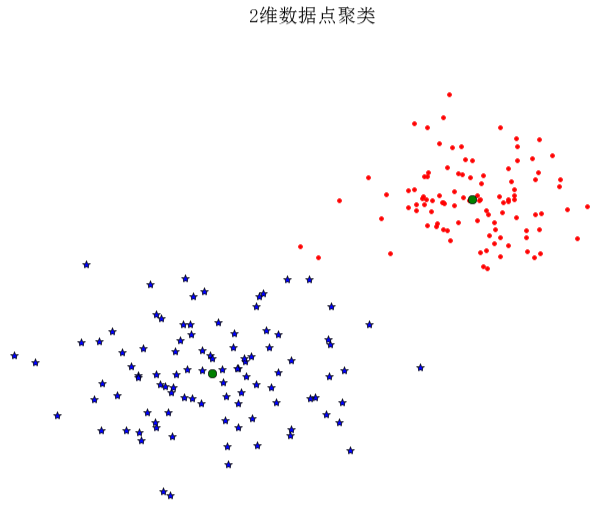
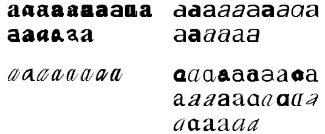
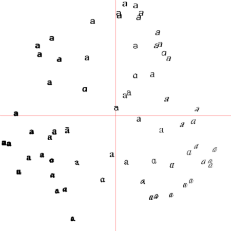
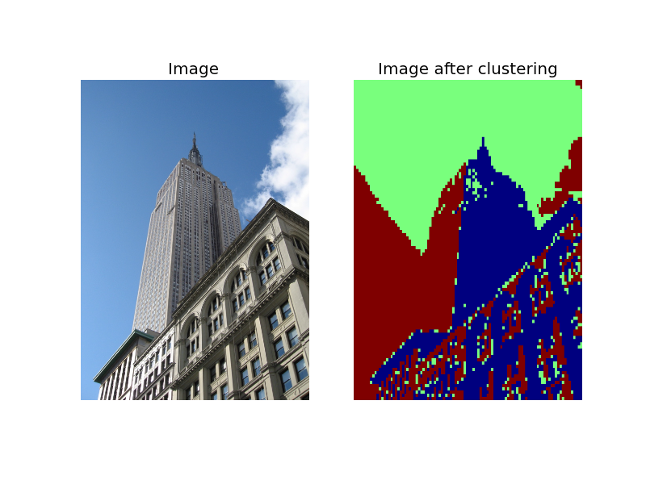
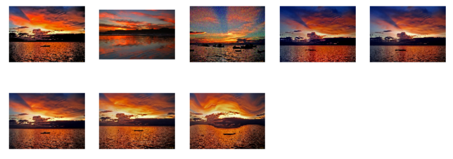
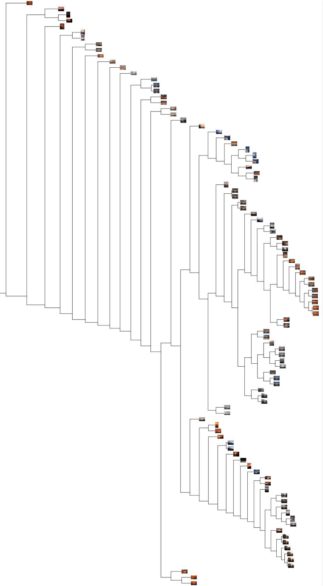
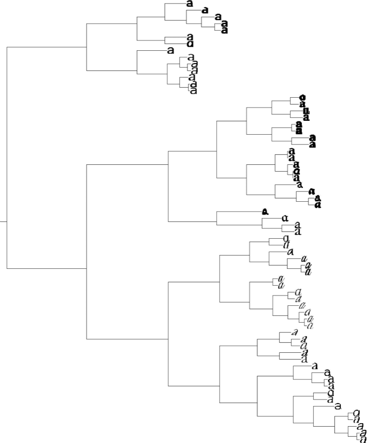
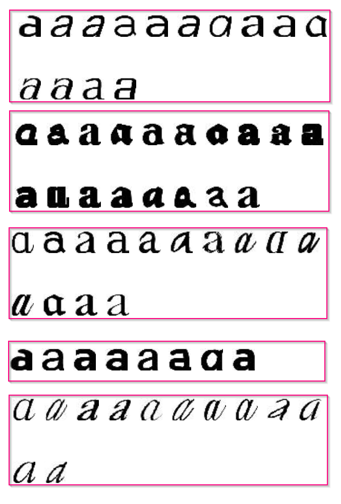
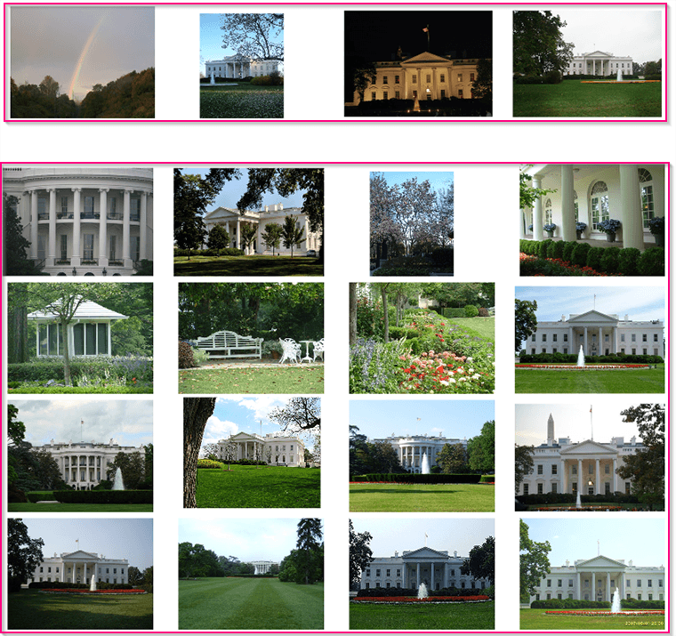
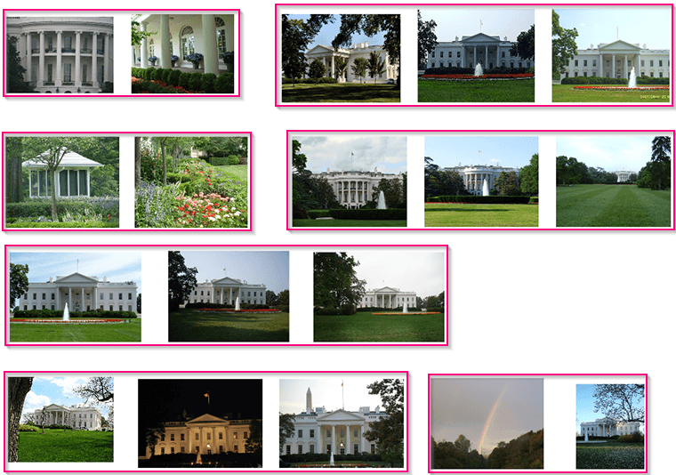

这一章会介绍几种聚类方法，并就怎么使用它们对图像进行聚类找出相似的图像组进行说明。聚类可以用于识别，划分图像数据集、组织导航等。同时，我们也会用聚类相似的图像进行可视化。

<h2 id="sec-6-1">6.1 K-Means聚类</h2>

K-means是一种非常简单的聚类算法，它能够将输入数据划分成k个簇。关于K-means聚类算法的介绍可以参阅中译本。

<h3 id="sec-6-1-1">6.1.1 SciPy聚类包</h3>

尽管K-means聚类算法很容易实现，但我们没必要自己去实现。SciPy矢量量化包sci.cluter.vq中有k-means的实现。这里我们演示怎样使用它。

我们以2维示例样本数据进行说明：

```python
# coding=utf-8
"""
Function:  figure 6.1
    An example of k-means clustering of 2D points
"""
from pylab import *
from scipy.cluster.vq import *

# 添加中文字体支持
from matplotlib.font_manager import FontProperties
font = FontProperties(fname=r"c:\windows\fonts\SimSun.ttc", size=14)

class1 = 1.5 * randn(100, 2)
class2 = randn(100, 2) + array([5, 5])
features = vstack((class1, class2))
centroids, variance = kmeans(features, 2)
code, distance = vq(features, centroids)
figure()
ndx = where(code == 0)[0]
plot(features[ndx, 0], features[ndx, 1], '*')
ndx = where(code == 1)[0]
plot(features[ndx, 0], features[ndx, 1], 'r.')
plot(centroids[:, 0], centroids[:, 1], 'go')

title(u'2维数据点聚类', fontproperties=font)
axis('off')
show()
```
上面代码中where()函数给出每类的索引。运行上面代码，可得到原书P129页图6-1，即：


<h3 id="sec-6-1-2">6.1.2 图像聚类</h3>

现在我们用k-means对原书14页的图像进行聚类，文件selectedfontimages.zip包含了66张字体图像。对于每一张图像，我们用在前40个主成分上投影后的系数作为特征向量。下面为对其进行聚类的代码：

```python
 # -*- coding: utf-8 -*-
from PCV.tools import imtools
import pickle
from scipy import *
from pylab import *
from PIL import Image
from scipy.cluster.vq import *
from PCV.tools import pca

# Uses sparse pca codepath.
imlist = imtools.get_imlist('../data/selectedfontimages/a_selected_thumbs/')

# 获取图像列表和他们的尺寸
im = array(Image.open(imlist[0]))  # open one image to get the size
m, n = im.shape[:2]  # get the size of the images
imnbr = len(imlist)  # get the number of images
print "The number of images is %d" % imnbr

# Create matrix to store all flattened images
immatrix = array([array(Image.open(imname)).flatten() for imname in imlist], 'f')

# PCA降维
V, S, immean = pca.pca(immatrix)

# 保存均值和主成分
#f = open('./a_pca_modes.pkl', 'wb')
f = open('./a_pca_modes.pkl', 'wb')
pickle.dump(immean,f)
pickle.dump(V,f)
f.close()


# get list of images
imlist = imtools.get_imlist('../data/selectedfontimages/a_selected_thumbs/')
imnbr = len(imlist)

# load model file
with open('../data/selectedfontimages/a_pca_modes.pkl','rb') as f:
    immean = pickle.load(f)
    V = pickle.load(f)
# create matrix to store all flattened images
immatrix = array([array(Image.open(im)).flatten() for im in imlist],'f')

# project on the 40 first PCs
immean = immean.flatten()
projected = array([dot(V[:40],immatrix[i]-immean) for i in range(imnbr)])

# k-means
projected = whiten(projected)
centroids,distortion = kmeans(projected,4)
code,distance = vq(projected,centroids)

# plot clusters
for k in range(4):
    ind = where(code==k)[0]
    figure()
    gray()
    for i in range(minimum(len(ind),40)):
        subplot(4,10,i+1)
        imshow(immatrix[ind[i]].reshape((25,25)))
        axis('off')
show()
```
运行上面代码，可得到下面的聚类结果：

注：这里的结果译者截的是原书上的结果，上面代码实际运行出来的结果可能跟上面有出入。

<h3 id="sec-6-1-3">6.1.3 在主成分上可视化图像</h3>

```python
 # -*- coding: utf-8 -*-
from PCV.tools import imtools, pca
from PIL import Image, ImageDraw
from pylab import *
from PCV.clustering import  hcluster

imlist = imtools.get_imlist('../data/selectedfontimages/a_selected_thumbs')
imnbr = len(imlist)

# Load images, run PCA.
immatrix = array([array(Image.open(im)).flatten() for im in imlist], 'f')
V, S, immean = pca.pca(immatrix)

# Project on 2 PCs.
projected = array([dot(V[[0, 1]], immatrix[i] - immean) for i in range(imnbr)])  # P131 Fig6-3左图
#projected = array([dot(V[[1, 2]], immatrix[i] - immean) for i in range(imnbr)])  # P131 Fig6-3右图

# height and width
h, w = 1200, 1200

# create a new image with a white background
img = Image.new('RGB', (w, h), (255, 255, 255))
draw = ImageDraw.Draw(img)

# draw axis
draw.line((0, h/2, w, h/2), fill=(255, 0, 0))
draw.line((w/2, 0, w/2, h), fill=(255, 0, 0))

# scale coordinates to fit
scale = abs(projected).max(0)
scaled = floor(array([(p/scale) * (w/2 - 20, h/2 - 20) + (w/2, h/2)
                      for p in projected])).astype(int)

# paste thumbnail of each image
for i in range(imnbr):
  nodeim = Image.open(imlist[i])
  nodeim.thumbnail((25, 25))
  ns = nodeim.size
  box = (scaled[i][0] - ns[0] // 2, scaled[i][1] - ns[1] // 2,
         scaled[i][0] + ns[0] // 2 + 1, scaled[i][1] + ns[1] // 2 + 1)
  img.paste(nodeim, box)

tree = hcluster.hcluster(projected)
hcluster.draw_dendrogram(tree,imlist,filename='fonts.png')

figure()
imshow(img)
axis('off')
img.save('../images/ch06/pca_font.png')
show()

```
运行上面代码，可画出原书P131图6-3中的实例结果。


<h3 id="sec-6-1-4">6.1.4 像素聚类</h3>

在结束这节前，我们看一个对像素进行聚类而不是对所有的图像进行聚类的例子。将图像区域归并成“有意义的”组件称为图像分割。在第九章会将其单独列为一个主题。在像素级水平进行聚类除了可以用在一些很简单的图像，在其他图像上进行聚类是没有意义的。这里，我们将k-means应用到RGB颜色值上，关于分割问题会在第九章第二节会给出分割的方法。下面是对两幅图像进行像素聚类的例子(注：译者对原书中的代码做了调整)：

```python
 # -*- coding: utf-8 -*-
"""
Function: figure 6.4
    Clustering of pixels based on their color value using k-means.
"""
from scipy.cluster.vq import *
from scipy.misc import imresize
from pylab import *
import Image

# 添加中文字体支持
from matplotlib.font_manager import FontProperties
font = FontProperties(fname=r"c:\windows\fonts\SimSun.ttc", size=14)

def clusterpixels(infile, k, steps):
	im = array(Image.open(infile))
	dx = im.shape[0] / steps
	dy = im.shape[1] / steps
	# compute color features for each region
	features = []
	for x in range(steps):
		for y in range(steps):
			R = mean(im[x * dx:(x + 1) * dx, y * dy:(y + 1) * dy, 0])
			G = mean(im[x * dx:(x + 1) * dx, y * dy:(y + 1) * dy, 1])
			B = mean(im[x * dx:(x + 1) * dx, y * dy:(y + 1) * dy, 2])
			features.append([R, G, B])
	features = array(features, 'f')     # make into array
	# 聚类， k是聚类数目
	centroids, variance = kmeans(features, k)
	code, distance = vq(features, centroids)
	# create image with cluster labels
	codeim = code.reshape(steps, steps)
	codeim = imresize(codeim, im.shape[:2], 'nearest')
	return codeim

k=3
infile_empire = '../data/empire.jpg'
im_empire = array(Image.open(infile_empire))
infile_boy_on_hill = '../data/boy_on_hill.jpg'
im_boy_on_hill = array(Image.open(infile_boy_on_hill))
steps = (50, 100)  # image is divided in steps*steps region
print steps[0], steps[-1]

#显示原图empire.jpg
figure()
subplot(231)
title(u'原图', fontproperties=font)
axis('off')
imshow(im_empire)

# 用50*50的块对empire.jpg的像素进行聚类
codeim= clusterpixels(infile_empire, k, steps[0])
subplot(232)
title(u'k=3,steps=50', fontproperties=font)
#ax1.set_title('Image')
axis('off')
imshow(codeim)

# 用100*100的块对empire.jpg的像素进行聚类
codeim= clusterpixels(infile_empire, k, steps[-1])
ax1 = subplot(233)
title(u'k=3,steps=100', fontproperties=font)
#ax1.set_title('Image')
axis('off')
imshow(codeim)

#显示原图empire.jpg
subplot(234)
title(u'原图', fontproperties=font)
axis('off')
imshow(im_boy_on_hill)

# 用50*50的块对empire.jpg的像素进行聚类
codeim= clusterpixels(infile_boy_on_hill, k, steps[0])
subplot(235)
title(u'k=3,steps=50', fontproperties=font)
#ax1.set_title('Image')
axis('off')
imshow(codeim)

# 用100*100的块对empire.jpg的像素进行聚类
codeim= clusterpixels(infile_boy_on_hill, k, steps[-1])
subplot(236)
title(u'k=3，steps=100', fontproperties=font)
axis('off')
imshow(codeim)

show()
```
上面代码中，先载入一幅图像，然后用一个steps*steps的方块在原图中滑动，对窗口中的图像值求和取平均，将它下采样到一个较低的分辨率，然后对这些区域用k-means进行聚类。运行上面代码，即可得出原书P133页图6-4中的图。


<h2 id="sec-6-2">6.2 层次聚类</h2>

层次聚类(或称凝聚聚类)是另一种简单但有效的聚类算法。下面我们我们通过一个简单的实例看看层次聚类是怎样进行的。

```python
from pylab import  *
from PCV.clustering import hcluster

class1 = 1.5 * randn(100,2)
class2 = randn(100,2) + array([5,5])
features = vstack((class1,class2))

tree = hcluster.hcluster(features)
clusters = tree.extract_clusters(5)
print 'number of clusters', len(clusters)
for c in clusters:
    print c.get_cluster_elements()
```
上面代码首先创建一些2维数据点，然后对这些数据点聚类，用一些阈值提取列表中的聚类后的簇群，并将它们打印出来，译者在自己的笔记本上打印出的结果为：

```text
number of clusters 2
[197, 107, 176, 123, 173, 189, 154, 136, 183, 113, 109, 199, 178, 129, 163, 100, 148, 111, 143, 118, 162, 169, 138, 182, 193, 116, 134, 198, 184, 181, 131, 166, 127, 185, 161, 171, 152, 157, 112, 186, 128, 156, 108, 158, 120, 174, 102, 137, 117, 194, 159, 105, 155, 132, 188, 125, 180, 151, 192, 164, 195, 126, 103, 196, 179, 146, 147, 135, 139, 110, 140, 106, 104, 115, 149, 190, 170, 172, 121, 145, 114, 150, 119, 142, 122, 144, 160, 187, 153, 167, 130, 133, 165, 191, 175, 177, 101, 141, 124, 168]
[0, 39, 32, 87, 40, 48, 28, 8, 26, 12, 94, 5, 1, 61, 24, 59, 83, 10, 99, 50, 23, 58, 51, 16, 71, 25, 11, 37, 22, 46, 60, 86, 65, 2, 21, 4, 41, 72, 80, 84, 33, 56, 75, 77, 29, 85, 93, 7, 73, 6, 82, 36, 49, 98, 79, 43, 91, 14, 47, 63, 3, 97, 35, 18, 44, 30, 13, 67, 62, 20, 57, 89, 88, 9, 54, 19, 15, 92, 38, 64, 45, 70, 52, 95, 69, 96, 42, 53, 27, 66, 90, 81, 31, 34, 74, 76, 17, 78, 55, 68]
```


<h2 id="sec-6-2-1">6.2.1 图像聚类</h2>

```python
 # -*- coding: utf-8 -*-
import os
import Image
from PCV.clustering import hcluster
from matplotlib.pyplot import *
from numpy import *

# create a list of images
path = '../data/sunsets/flickr-sunsets-small/'
imlist = [os.path.join(path, f) for f in os.listdir(path) if f.endswith('.jpg')]
# extract feature vector (8 bins per color channel)
features = zeros([len(imlist), 512])
for i, f in enumerate(imlist):
    im = array(Image.open(f))
    # multi-dimensional histogram
    h, edges = histogramdd(im.reshape(-1, 3), 8, normed=True, range=[(0, 255), (0, 255), (0, 255)])
    features[i] = h.flatten()
tree = hcluster.hcluster(features)

# visualize clusters with some (arbitrary) threshold
clusters = tree.extract_clusters(0.23 * tree.distance)
# plot images for clusters with more than 3 elements
for c in clusters:
    elements = c.get_cluster_elements()
    nbr_elements = len(elements)
    if nbr_elements > 3:
        figure()
        for p in range(minimum(nbr_elements,20)):
            subplot(4, 5, p + 1)
            im = array(Image.open(imlist[elements[p]]))
            imshow(im)
            axis('off')
show()

hcluster.draw_dendrogram(tree,imlist,filename='sunset.pdf')
```
运行上面代码，可得原书P140图6-6。


同时会在上面脚本文件所在的文件夹下生成层次聚类后的簇群树：

我们对前面字体图像同样创建一个树，正如前面在主成分可视化图像中，我们添加了下面代码：

```
tree = hcluster.hcluster(projected)
hcluster.draw_dendrogram(tree,imlist,filename='fonts.png')
```
运行添加上面两行代码后前面的例子，可得对字体进行层次聚类后的簇群树：


<h2 id="sec-6-3">6.3 谱聚类</h2>

谱聚类是另一种不同于k-means和层次聚类的聚类算法。关于谱聚类的原理，可以参阅中译本。这里，我们用原来k-means实例中用到的字体图像。

```python
 # -*- coding: utf-8 -*-
from PCV.tools import imtools, pca
from PIL import Image, ImageDraw
from pylab import *
from scipy.cluster.vq import *

imlist = imtools.get_imlist('../data/selectedfontimages/a_selected_thumbs')
imnbr = len(imlist)

# Load images, run PCA.
immatrix = array([array(Image.open(im)).flatten() for im in imlist], 'f')
V, S, immean = pca.pca(immatrix)

# Project on 2 PCs.
projected = array([dot(V[[0, 1]], immatrix[i] - immean) for i in range(imnbr)])  # P131 Fig6-3左图
#projected = array([dot(V[[1, 2]], immatrix[i] - immean) for i in range(imnbr)])  # P131 Fig6-3右图

n = len(projected)
# compute distance matrix
S = array([[ sqrt(sum((projected[i]-projected[j])**2))
for i in range(n) ] for j in range(n)], 'f')
# create Laplacian matrix
rowsum = sum(S,axis=0)
D = diag(1 / sqrt(rowsum))
I = identity(n)
L = I - dot(D,dot(S,D))
# compute eigenvectors of L
U,sigma,V = linalg.svd(L)
k = 5
# create feature vector from k first eigenvectors
# by stacking eigenvectors as columns
features = array(V[:k]).T
# k-means
features = whiten(features)
centroids,distortion = kmeans(features,k)
code,distance = vq(features,centroids)
# plot clusters
for c in range(k):
    ind = where(code==c)[0]
    figure()
    gray()
    for i in range(minimum(len(ind),39)):
        im = Image.open(imlist[ind[i]])
        subplot(4,10,i+1)
        imshow(array(im))
        axis('equal')
        axis('off')
show()
```
上面我们在前个特征向量上计算标准的k-means。下面是运行上面代码的结果：

注意，由于在k-means阶段会给出不同的聚类结果，所以你运行上面代码出来的结果可能跟译者的是不一样的。

同样，我们可以在不知道特征向量或是没有严格相似性定义的情况下进行谱聚类。原书44页的位置地理图像是通过它们之间有多少局部描述子匹配相连接的。48页的相似性矩阵中的元素是为规范化的匹配特征点数。我们同样可以对其进行谱聚类，完整的代码如下：

```python
 # -*- coding: utf-8 -*-
from PCV.tools import imtools, pca
from PIL import Image, ImageDraw
from PCV.localdescriptors import sift
from pylab import *
import glob
from scipy.cluster.vq import *


#download_path = "panoimages"  # set this to the path where you downloaded the panoramio images
#path = "/FULLPATH/panoimages/"  # path to save thumbnails (pydot needs the full system path)

download_path = "F:/dropbox/Dropbox/translation/pcv-notebook/data/panoimages"  # set this to the path where you downloaded the panoramio images
path = "F:/dropbox/Dropbox/translation/pcv-notebook/data/panoimages/"  # path to save thumbnails (pydot needs the full system path)

# list of downloaded filenames
imlist = imtools.get_imlist('../data/panoimages/')
nbr_images = len(imlist)

# extract features
#featlist = [imname[:-3] + 'sift' for imname in imlist]
#for i, imname in enumerate(imlist):
#    sift.process_image(imname, featlist[i])

featlist = glob.glob('../data/panoimages/*.sift')

matchscores = zeros((nbr_images, nbr_images))

for i in range(nbr_images):
    for j in range(i, nbr_images):  # only compute upper triangle
        print 'comparing ', imlist[i], imlist[j]
        l1, d1 = sift.read_features_from_file(featlist[i])
        l2, d2 = sift.read_features_from_file(featlist[j])
        matches = sift.match_twosided(d1, d2)
        nbr_matches = sum(matches > 0)
        print 'number of matches = ', nbr_matches
        matchscores[i, j] = nbr_matches
print "The match scores is: \n", matchscores

# copy values
for i in range(nbr_images):
    for j in range(i + 1, nbr_images):  # no need to copy diagonal
        matchscores[j, i] = matchscores[i, j]

n = len(imlist)
# load the similarity matrix and reformat
S = matchscores
S = 1 / (S + 1e-6)
# create Laplacian matrix
rowsum = sum(S,axis=0)
D = diag(1 / sqrt(rowsum))
I = identity(n)
L = I - dot(D,dot(S,D))
# compute eigenvectors of L
U,sigma,V = linalg.svd(L)
k = 2
# create feature vector from k first eigenvectors
# by stacking eigenvectors as columns
features = array(V[:k]).T
# k-means
features = whiten(features)
centroids,distortion = kmeans(features,k)
code,distance = vq(features,centroids)
# plot clusters
for c in range(k):
    ind = where(code==c)[0]
    figure()
    gray()
    for i in range(minimum(len(ind),39)):
        im = Image.open(imlist[ind[i]])
        subplot(5,4,i+1)
        imshow(array(im))
        axis('equal')
        axis('off')
show()
```
改变聚类数目k，可以得到不同的结果。译者分别测试了原书中k=2和k=10的情况，运行结果如下：
**k=2**

**k=10**

注：对于聚类后，图像小于或等于1的类，在上面没有显示。