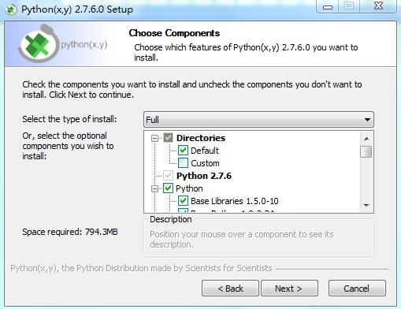
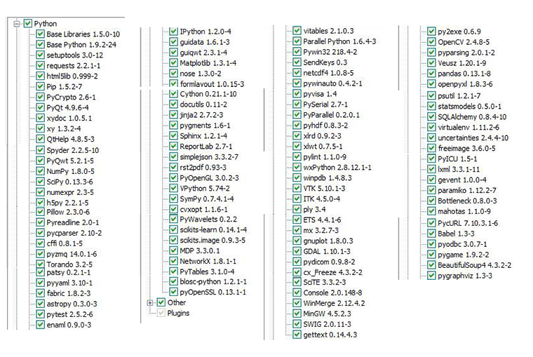
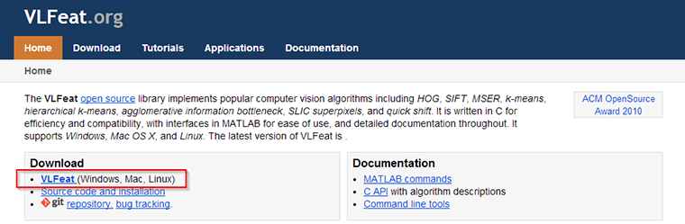
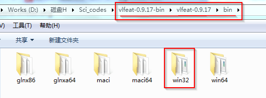
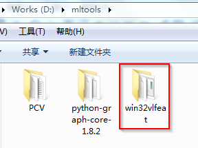
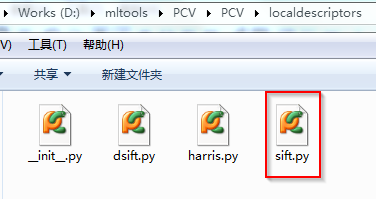

为顺利帮助读者完成本书中实例的学习，译者已对代码做了相应整理，下面给出在对本书实例学习前，你需要做的前期安装工作。注意，下面译者给出的安装过程是针对**Windows**下的，其他平台如Linux、Mac请查阅中译本附录。

<h2 id="sec-0-1">0.1 需要准备的安装包</h2>

要完整复现书中的实例，你需要的主要四个文件包括Python(x,y) 2.7.x安装包、PCV库、[VLfeat](http://www.vlfeat.org/download.html)和本书用到的数据库。Python(x,y)可以在[Google Code]((https://code.google.com/p/pythonxy/)),PCV库、本书整理出来的实例代码以及本书用到的所有图像数据可以从[首页](http://yuanyong.org/pcvwithpython/)给出的链接下载。

<h2 id="sec-0-2">0.2 安装Python(x,y)</h2>

在Windows下，译者推荐你安装Python(x,y) 2.7.x。Python(x,y) 2.7.x是一个库安装包，除了包含Python自身外，还包含了很多第三方库，下面是安装Python(x,y)时的界面：


从上面第二幅图可以看出，pythonxy不仅包含了SciPy、NumPy、PyLab、OpenCV、MatplotLib,还包含了机器学习库scikits-learn。
为避免出现运行实例时出现的依赖问题，译者建议将上面的库全部选上，也就是选择“full”(译者也是用的全部安装的方式进行后面的实验的)。安装完成后，为验证安装是否正确，可以在Python shell里确认一下OpenCV是否已安装来进行验证，在Python Shell里输入下面命令：

```python
from cv2 import __version__
__version__
```
输入上面命令，如果可以看到OpenCV的版本信息，则说明python(x,y)已安装正确。

另外，需要提醒读者的是，Python是没有平台区分的，这里指的平台不是指Linux和Mac这样的平台概念，而是在Windows上没有位数的区分。举个简单的例子，比如你是64位的Windows系统，你可以安装32位的Python。对于这一部分的详细说明，可以参阅译者的一篇博文[Django配置MySQL](http://yuanyong.org/blog/config-mysql-for-django.html)最后一段的说明。好了，关于Python(x,y)的安装说明就说到这里。

<h2 id="sec-0-3">0.3 安装PCV库</h2>

PCV库是原书作者写的一个第三方库，书中几乎所有的实例到要用到改库。假设你已从下载本书由译者整理的中译版源码，从Windows cmd终端进入PCV所在目录：

```sh
cd PCV
python setup.py install
```
运行上面命令，即可完成PCV库的安装。为了验证PCV库是否安装成功，在运行上面命令后，可以打开Python自带的Shell，在Shell输入：

```python
import PCV
```
如果未报错，则表明你已成功安装了该PCV库。

<h2 id="sec-0-4">0.4 VLfeat</h2>

VLFeat是一个跨平台的开源机器视觉库，它囊括了当前流行的机器视觉算法，如SIFT, MSER, HOG, 同时还包含了诸如K-MEANS, Hierarchical K-means的聚类算法。本书中主要在提取sift特征时用到了VLfeat。

如上图所示，从红色框标的地方下载VLFeat,解压：

你需要的仅是对应平台的可执行文件，译者系统是32位的，所以选用的是win32。注意目前VLFeat最新发布版已到0.9.18了。对于0.9.18，目录结构和0.9.17的一样，所以你也仅需bin下对应的文件夹下的可执行文件。
将该win32拷贝到你想放置的某个目录，译者将其放置在计算机的如下目录：

需要注意的是，译者将原来的“bin”文件名重新"win32vlfeat"。完成该步骤后，进入PCV所在目录：

打开sift.py，找到下面代码：

```python
def process_image(imagename,resultname,params="--edge-thresh 10 --peak-thresh 5"):
	""" process an image and save the results in a file"""

	if imagename[-3:] != 'pgm':
		#create a pgm file
		im = Image.open(imagename).convert('L')
		im.save('tmp.pgm')
		imagename = 'tmp.pgm'

	cmmd = str("D:\mltools\win32vlfeat\sift.exe "+imagename+" --output="+resultname+
				" "+params)
	os.system(cmmd)
	print 'processed', imagename, 'to', resultname
```
将cmmd中的目录修改为你自己放置的Vlfeat bin所在目录。这里稍微解释一下os.system(cmmd)这句话的意思，这里Python通过os.system（）调用外部可执行文件，也就是Vlfeat bin目录下的sift.exe。

好了，安装完后，你便可以运行书中的大部分实例代码了。这里之所以是“大部分”是因为书中的某些实例，还要用到别的库。

<div class="navigation">
  <a class="prev_page" href="author.html">&laquo; 作者译者</a>
  <a class="next_page" href="chapter1.html">第一章 图像处理基础 &raquo;</a>
</div>
